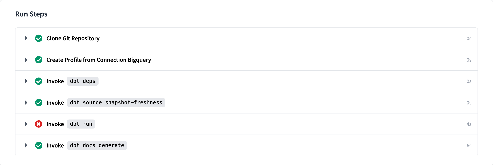

# dbt Cloud action

This action lets you trigger a job run on [dbt Cloud](https://cloud.getdbt.com), fetches the `run_results.json` artifact, and `git checkout`s the branch that was ran by dbt Cloud.

Example usage at [fal-ai/fal_bike_example](https://github.com/fal-ai/fal_bike_example)

## Inputs

### Credentials

- `dbt_cloud_token` - dbt Cloud [API token](https://docs.getdbt.com/docs/dbt-cloud/dbt-cloud-api/service-tokens)
- `dbt_cloud_account_id` - dbt Cloud Account ID
- `dbt_cloud_job_id` - dbt Cloud Job ID

We recommend passing sensitive variables as GitHub secrets. [Example usage](https://github.com/fal-ai/fal_bike_example/blob/main/.github/workflows/fal_dbt.yml).

### Action configuration

- `failure_on_error` - Boolean to make the action report a failure when dbt-cloud runs. Mark this as `false` to run fal after the dbt-cloud job.
- `interval` - The interval between polls in seconds (Default: `30`)

### dbt Cloud Job configuration

Use any of the [documented options for the dbt API](https://docs.getdbt.com/dbt-cloud/api-v2#tag/Jobs/operation/triggerRun).

- `cause` (Default: `Triggered by a Github Action`)
- `git_sha`
- `git_branch`
- `schema_override`
- `dbt_version_override`
- `threads_override`
- `target_name_override`
- `generate_docs_override`
- `timeout_seconds_override`
- `steps_override`: pass a YAML-parseable string. (e.g. `steps_override: '["dbt seed", "dbt run"]'`)

## Create your workflow
```yaml
name: Run dbt cloud
on:
  workflow_dispatch:

jobs:
  deploy:
    runs-on: ubuntu-latest

    steps:
      - uses: fal-ai/dbt-cloud-action@main
        id: dbt_cloud_run
        with:
          dbt_cloud_token: ${{ secrets.DBT_CLOUD_API_TOKEN }}
          dbt_cloud_account_id: ${{ secrets.DBT_CLOUD_ACCOUNT_ID }}
          dbt_cloud_job_id: ${{ secrets.DBT_CLOUD_JOB_ID }}
          failure_on_error: true
          steps_override: |
            - dbt seed
            - dbt run
```

### Use with [fal](https://github.com/fal-ai/fal)

You can trigger a dbt Cloud run and it will download the artifacts to be able to run your `fal run` command easily in GitHub Actions.

You have to do certain extra steps described here:

```yaml
name: Run dbt cloud and fal scripts
on:
  workflow_dispatch:

jobs:
  deploy:
    runs-on: ubuntu-latest

    steps:
      # Checkout before downloading artifacts or setting profiles.yml
      - uses: actions/checkout@v3
        with:
          fetch-depth: 0

      - uses: fal-ai/dbt-cloud-action@main
        id: dbt_cloud_run
        with:
          dbt_cloud_token: ${{ secrets.DBT_CLOUD_API_TOKEN }}
          dbt_cloud_account_id: ${{ secrets.DBT_ACCOUNT_ID }}
          dbt_cloud_job_id: ${{ secrets.DBT_CLOUD_JOB_ID }}
          failure_on_error: false

      - name: Setup profiles.yml
        shell: python
        env:
          contents: ${{ secrets.PROFILES_YML }}
        run: |
          import yaml
          import os
          import io

          profiles_string = os.getenv('contents')
          profiles_data = yaml.safe_load(profiles_string)

          with io.open('profiles.yml', 'w', encoding='utf8') as outfile:
            yaml.dump(profiles_data, outfile, default_flow_style=False, allow_unicode=True)

      - uses: actions/setup-python@v2
        with:
          python-version: "3.9.x"

      - name: Install dependencies
        # Normally would use a `requirements.txt`.
        run: |
          pip install dbt-bigquery
          pip install fal[bigquery]

      - name: Run fal scripts
        env:
          SLACK_BOT_TOKEN: ${{ secrets.SLACK_BOT_TOKEN }}
          SLACK_BOT_CHANNEL: ${{ secrets.SLACK_BOT_CHANNEL }}
        run: |
          # Move to the same code state of the dbt Cloud Job
          git checkout ${{ steps.dbt_cloud_run.outputs.git_sha }}
          # TODO: review target in passed profiles.yaml contents
          fal run --profiles-dir .

```

#### Getting the correct artifacts from dbt-cloud

fal relies on the generated artifacts from a dbt run step to get model statuses. dbt-cloud only makes these artifacts available after the **last** step finished running.

In order to get the status information that you need for fal, make sure to run the step you are interested in **last**.

For example, this dbt job will provide the `run_results.json` of `dbt docs generate`, which is probably not what you want fal to report about:



So, you would make `dbt docs generate` run before `dbt run` and leave `dbt run` as the last step.
